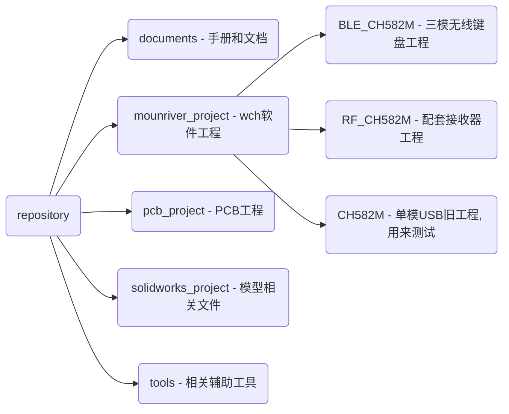
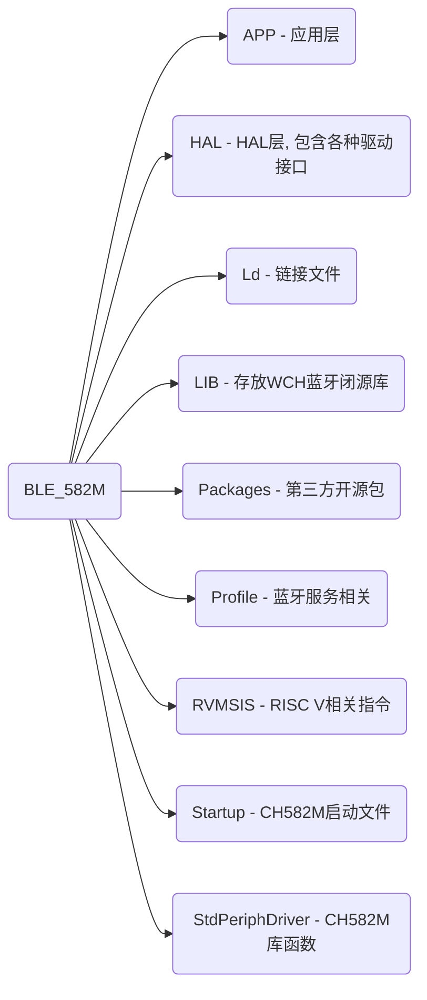

<h1 align="center">TrackPoint78 </h1>

TrackPoint78是基于CH582M的三模机械键盘方案。

V2.0新特性：

1. 支持USB U盘改键和配置

2. 支持触摸板触摸条操作

3. 集成USB hub接口

4. 增加I2C磁吸扩展口

5. 集成RF模式和接收器方案

6. 增加I2C小红点方案

7. 增加触摸条震动反馈

8. 优化OELD UI

9. 增加Fn+B进BootLoader功能

10. 增加待机自动进lowpower模式

11. ...

### 仓库目录

### 软件工程目录

### 关于固件升级Q&A

- **Q**: 如何进入BOOTLOADER？

- **A:** 按住底板中BOOT键通电，或按下Fn+B进入BOOTLOADER。注意：Fn+B后会擦除部分CodeFlash部分片段，上电后必须先下载程序。

- **Q:** 如何升级固件？

- **A:** 使用WCH官方ISP工具进行固件升级，工具目录：tools/WCHISPTool/WCHISPTool.exe。
  
  > - 选择CH58x系列；
  > 
  > - 在USB设备列表里找到自己的设备，若找不到尝试重新进入BOOT；
  > 
  > - 根据需求勾选相关下载配置，若不确定可进行咨询，一般使用默认配置即可；
  > 
  > - 选择用户程序文件；
  > 
  > - 最后点击下载。

- **Q:** 多次点击下载后，进度条跑完显示失败。

- **A:** 建议更换核心板。
